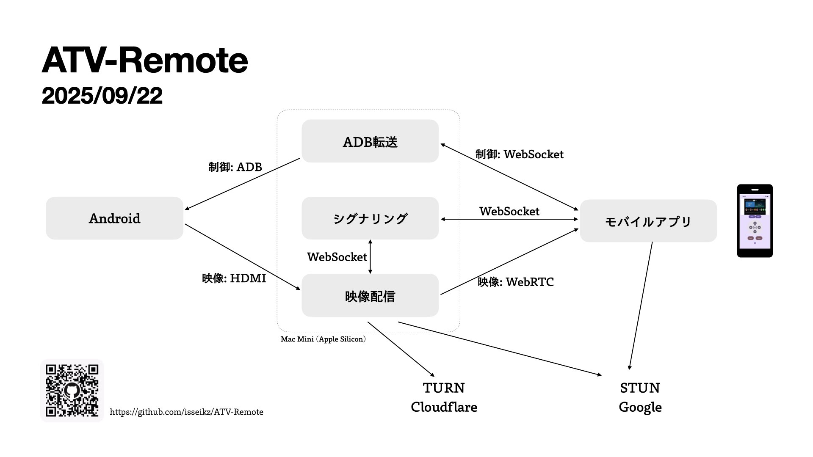

# 設計仕様：ATV-Remote-KMP

## バージョン履歴

- 2025-09-22: 初版作成 (isseikz)

## 技術選択と根拠 🛠️

### プラットフォーム・言語選択

* **Kotlin Multiplatform (KMP)**: サーバー・クライアント間のコード共有により開発効率を向上し、型安全性を保証
* **Kotlin/JS (WASM)**: ブラウザでの実行、WebAssemblyによる高パフォーマンス
* **Ktor**: 軽量で拡張性の高いサーバーフレームワーク、WebSocketサポート
* **Compose Multiplatform**: 宣言的UIによる保守性の高いクロスプラットフォーム開発（Android、iOS、Web対応）

### 通信・RPC技術選択

* **kotlinx-rpc**: 型安全なRPC通信フレームワーク、サーバー・クライアント間の統一的なAPI定義
* **WebRTC**: P2P通信による超低遅延ストリーミングを実現
* **Ktor WebSocket**: シグナリングとリアルタイム制御コマンド送信
* **Android Debug Bridge (ADB)**: Android TVデバイスへの標準的なアクセス手段

### 映像・音声処理技術

* **webrtc-kmp**: KMP環境でのWebRTC実装、マルチプラットフォーム対応
* **webrtc-java**: サーバーサイドでのWebRTC実装、MediaDevicesによる映像キャプチャ機能を含む
* **WebRTC-SDK (iOS)**: iOS向けネイティブWebRTC実装

## システムアーキテクチャ 🏗️

本システムは、マルチプラットフォームクライアント、Ktorサーバー、Android TV デバイス、そしてHDMIキャプチャデバイスの4コンポーネントで構成されます。kotlinx-rpcによる型安全なAPI通信、WebRTCによるシグナリングとストリーミング、ADBによるデバイス操作を組み合わせています。



### 映像ストリーミングフロー

1. **映像キャプチャ**: Android TV デバイスのHDMI出力がUSBキャプチャデバイスに入力
2. **映像取得**: サーバーがwebrtc-javaのMediaDevicesでキャプチャデバイスから映像を取得
3. **WebRTCシグナリング**: クライアントがISignalingServiceを通じてSDP offer/answerを交換
4. **P2P接続確立**: WebRTCのPeerConnection確立、ICE候補交換
5. **映像配信**: サーバーからクライアントにWebRTCストリームを直接送信
6. **映像表示**: クライアントがCompose Video要素で映像をレンダリング

### デバイス制御フロー

1. **デバイス発見**: クライアントがIAtvControlService.adbDevices()でデバイス一覧を取得
2. **コマンド送信**: クライアントがsendAdbCommand()でリモート操作コマンドを送信
3. **ADB実行**: サーバーのAdbManagerがプロセス経由でadbコマンドを実行
4. **結果返却**: ADB実行結果をFlow<AdbCommandResult>でクライアントに返却

### アーキテクチャの選択理由

* **kotlinx-rpc**: 型安全なAPI定義により、サーバー・クライアント間のインターフェース統一とコンパイル時エラー検出を実現
* **WebRTC P2P通信**: 映像ストリーミングにおける超低遅延通信を実現、サーバー負荷を軽減
* **Compose Multiplatform**: 単一コードベースでAndroid、iOS、Webアプリケーションを開発、保守コストを削減
* **KMP共有ライブラリ**: データモデルとサービスインターフェースを共有し、プラットフォーム間の一貫性を保証

## 技術スタック詳細 📋

| カテゴリ       | 技術                         | バージョン  | 役割                                   |
|------------|----------------------------|---------|--------------------------------------|
| 言語         | Kotlin                     | 2.2.0   | プロジェクト全体の開発言語                        |
| プラットフォーム  | Kotlin Multiplatform (KMP) | 2.2.0   | マルチプラットフォーム開発基盤                      |
| サーバー      | Ktor                       | 3.2.1   | WebSocketサーバー、HTTP API                |
| UIフレームワーク | Compose Multiplatform      | 1.8.2   | 宣言的クロスプラットフォームUI                     |
| RPC        | kotlinx-rpc                | 0.9.1   | 型安全なRPC通信フレームワーク                     |
| WebRTC (共通) | webrtc-kmp                 | 0.125.11| マルチプラットフォームWebRTC実装                  |
| WebRTC (Server) | webrtc-java               | 0.14.0  | サーバーサイドWebRTC、MediaDevices映像キャプチャ機能含む |
| WebRTC (iOS) | WebRTC-SDK                | 125.6422.07 | iOS向けネイティブWebRTC実装               |
| シリアライゼーション | kotlinx-serialization        | 1.8.0   | JSON シリアライゼーション                     |
| コルーチン     | kotlinx-coroutines         | 1.10.2  | 非同期処理・並行処理                          |

## プロジェクト構成 📁

```
ATV-Remote/
├── composeApp/              # Compose Multiplatform クライアントアプリケーション
│   ├── src/commonMain/      # 共通UI・ViewModel
│   ├── src/androidMain/     # Android固有実装
│   ├── src/iosMain/         # iOS固有実装 (CocoaPods)
│   └── src/wasmJsMain/      # Web (WASM/JS) 固有実装
├── server/                  # Ktor サーバーアプリケーション
│   └── src/main/kotlin/     # サーバーサイド実装
│       ├── service/         # ビジネスロジック・サービス
│       ├── client/          # ADB・WebRTC クライアント
│       └── plugins/         # Ktor プラグイン設定
├── shared/                  # KMP 共有ライブラリ
│   ├── src/commonMain/      # 共通データモデル・RPC インターフェース
│   ├── src/androidMain/     # Android固有プラットフォーム実装
│   ├── src/iosMain/         # iOS固有プラットフォーム実装
│   ├── src/jvmMain/         # JVM固有プラットフォーム実装
│   ├── src/wasmJsMain/      # WebAssembly/JS 固有実装
│   └── src/serverMain/      # サーバー固有実装
└── iosApp/                  # iOS アプリエントリーポイント (予定)
```

## 主要コンポーネント 🔧

### サーバーサイド (Ktor JVM)

* **AdbManager**: ADBコマンド実行・デバイス管理
* **SignalingServiceImpl**: WebRTCシグナリング管理
* **AtvControlServiceImpl**: RPC サービス実装
* **SessionManager**: WebRTC セッション管理
* **WebRTCClientImpl**: サーバーサイドWebRTC実装

### クライアントサイド (Compose Multiplatform)

* **AppViewModel**: UI状態管理・RPC通信制御
* **Video**: プラットフォーム固有の映像レンダリング
* **DPadComponent**: Android TV リモートコントロール UI
* **ExpandableDropDown**: デバイス選択UI

### 共有ライブラリ (KMP)

* **IAtvControlService**: ADB制御RPC インターフェース
* **ISignalingService**: WebRTCシグナリングRPC インターフェース
* **RpcModels**: 通信用データモデル定義

## 実装上の制約と考慮事項 ⚠️

### 技術的制約

* WebRTCシグナリングサーバーの実装とP2P接続管理の複雑性
* USBキャプチャデバイスの性能制限とエンコード処理負荷
* プラットフォーム間でのWebRTC実装差異（特にiOS WebRTC-SDK）
* macOS aarch64でのwebrtc-java依存性

### セキュリティ考慮事項

* イントラネット利用が前提だが、システムへのアクセス制御が必要
* ADBによる強力なデバイス操作権限の管理
* 映像ストリームの暗号化と認証
* RPC通信のセキュリティ確保