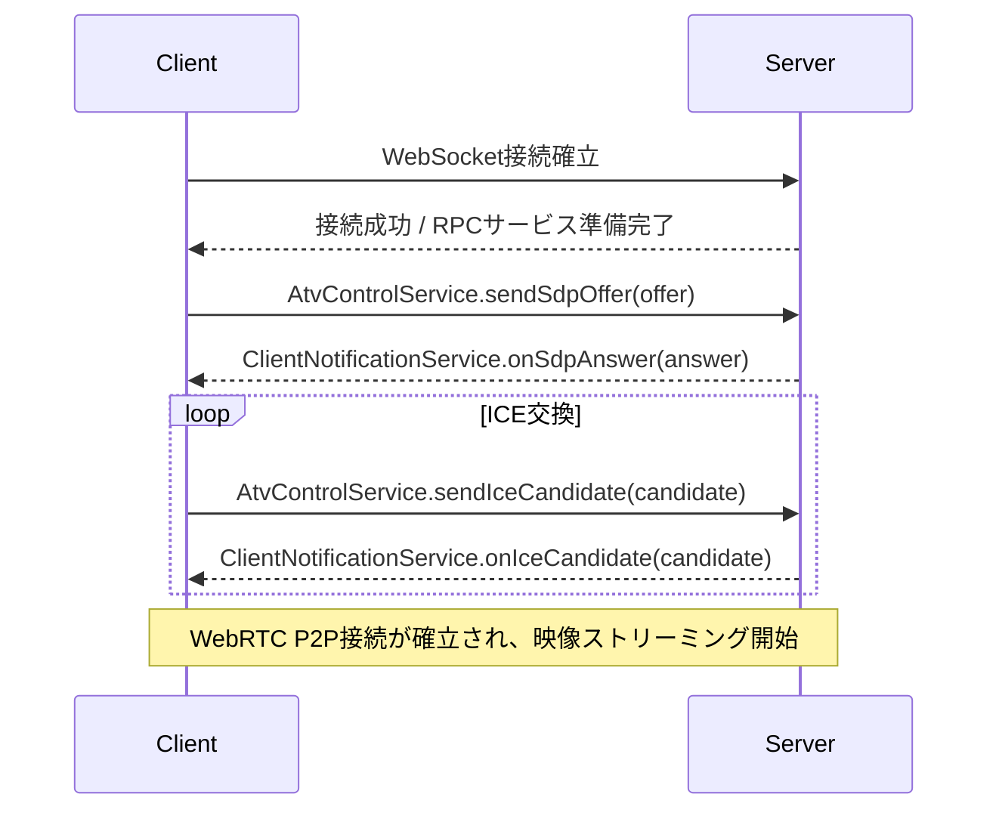
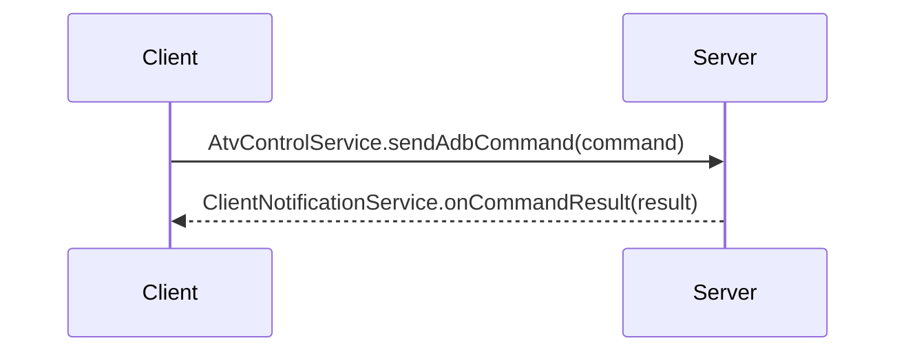

# **API仕様書：ATV-Remote-KMP**

### **1. 概要**

本文書は、ATV-Remote-KMP プロジェクトにおけるサーバーとクライアント間の通信APIを定義します。  
通信基盤として kotlinx-rpc ライブラリを採用し、全ての通信は単一のWebSocketコネクション上で行われます。  
kotlinx-rpc の双方向通信モデルに基づき、クライアントからサーバーを呼び出す **AtvControlService** と、サーバーからクライアントを呼び出す **ClientNotificationService** の2つのサービスを定義します。

### **2. 共有データモデル**

これらのサービス間で送受信されるデータは、全て commonMain ソースセットで定義され、kotlinx-serialization によってシリアライズされます。

| クラス名             | プロパティ         | 型       | 説明                                         |
|:-----------------|:--------------|:--------|:-------------------------------------------|
| SdpData          | type          | String  | SDPの種類。"offer" または "answer"。               |
|                  | sdp           | String  | SDP本体の文字列。                                 |
| IceCandidateData | candidate     | String  | ICE Candidate本体の文字列。                       |
|                  | sdpMid        | String  | 関連付けられるメディア記述のID。                          |
|                  | sdpMLineIndex | Int     | 関連付けられるメディア記述のインデックス。                      |
| AdbCommand       | command       | String  | 実行するADBコマンドの引数部分。例: shell input keyevent 3 |
| AdbCommandResult | output        | String  | コマンドの実行結果（標準出力）。                           |
|                  | isSuccess     | Boolean | コマンドが正常に終了したかどうかのフラグ。                      |

```kotlin
// commonMain/kotlin/tokyo/isseikuzumaki/atvremote/shared/RpcModels.kt

@Serializable  
data class SdpData(val type: String, val sdp: String)

@Serializable  
data class IceCandidateData(  
val candidate: String,  
val sdpMid: String,  
val sdpMLineIndex: Int  
)

@Serializable  
data class AdbCommand(val command: String)

@Serializable  
data class AdbCommandResult(val output: String, val isSuccess: Boolean)
```

### **3. RPCサービス定義**

#### **3.1 AtvControlService (クライアント → サーバー)**

クライアントからサーバーの機能を呼び出すためのインターフェースです。

```kotlin
// commonMain/kotlin/com/yourcompany/atvremote/shared/AtvControlService.kt

interface AtvControlService {  
/**  
* WebRTC接続を開始するため、クライアントのSDP Offerをサーバーに送信します。  
* @param offer SDP Offer情報を含むデータクラス。  
*/  
suspend fun sendSdpOffer(offer: SdpData)

    /**  
     * クライアント側で発見されたICE Candidateをサーバーに送信します。  
     * @param candidate ICE Candidate情報を含むデータクラス。  
     */  
    suspend fun sendIceCandidate(candidate: IceCandidateData)

    /**  
     * 指定されたADBコマンドの実行をサーバーに要求します。  
     * @param command 実行したいADBコマンド。  
     */  
    suspend fun sendAdbCommand(command: AdbCommand)  
}
```

#### **3.2 ClientNotificationService (サーバー → クライアント)**

サーバーからクライアントへ、イベントやデータをプッシュ通知するためのインターフェースです。

```kotlin
// commonMain/kotlin/com/yourcompany/atvremote/shared/ClientNotificationService.kt

interface ClientNotificationService {  
/**  
* サーバーが生成したSDP Answerをクライアントに返送します。  
* @param answer SDP Answer情報を含むデータクラス。  
*/  
suspend fun onSdpAnswer(answer: SdpData)

    /**  
     * サーバー側で発見されたICE Candidateをクライアントに送信します。  
     * @param candidate ICE Candidate情報を含むデータクラス。  
     */  
    suspend fun onIceCandidate(candidate: IceCandidateData)

    /**  
     * サーバーでのADBコマンド実行結果をクライアントに通知します。  
     * @param result コマンドの実行結果。  
     */  
    suspend fun onCommandResult(result: AdbCommandResult)  
}
```

### **4. 通信フローの例 (シーケンス)**

#### **WebRTC シグナリングフロー**



#### **ADB コマンド実行フロー**



