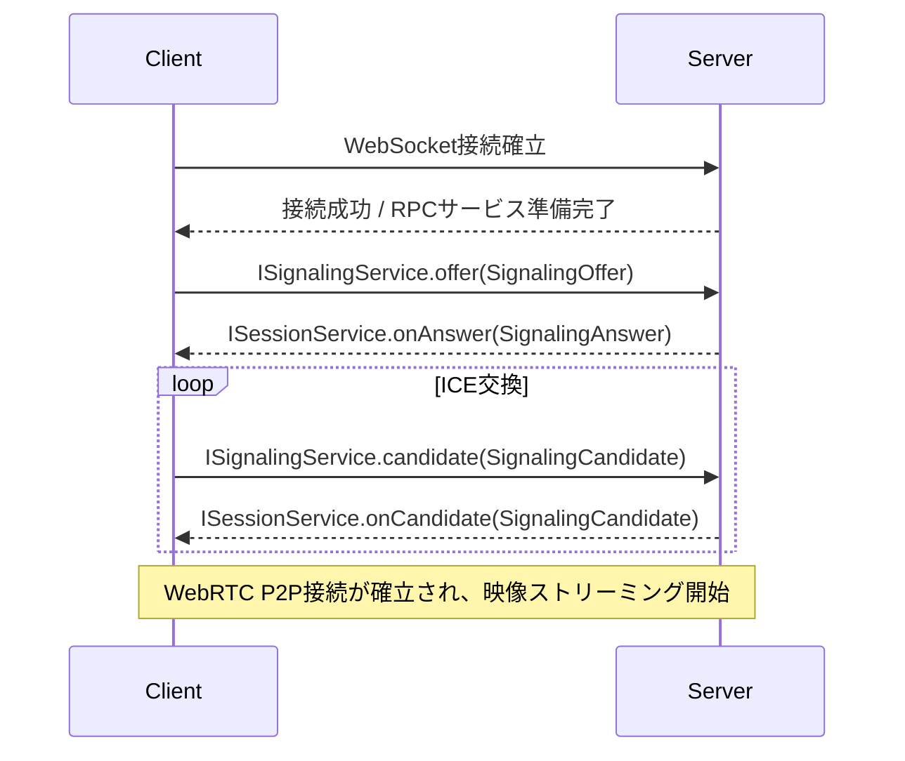
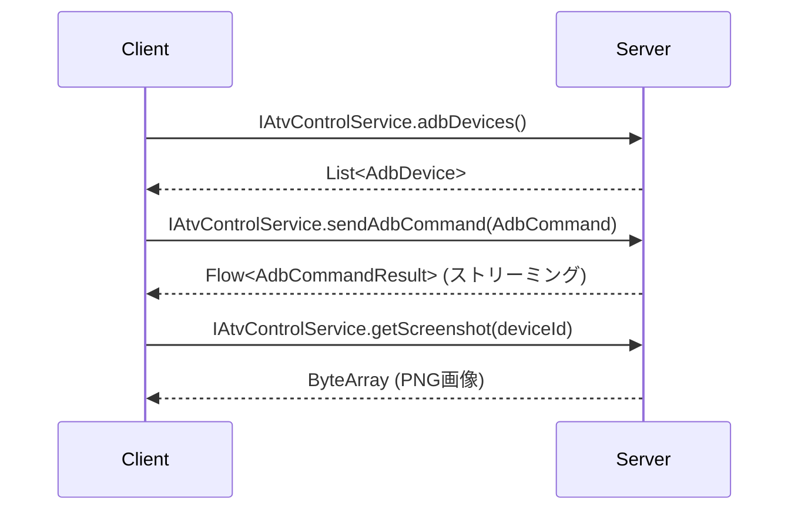
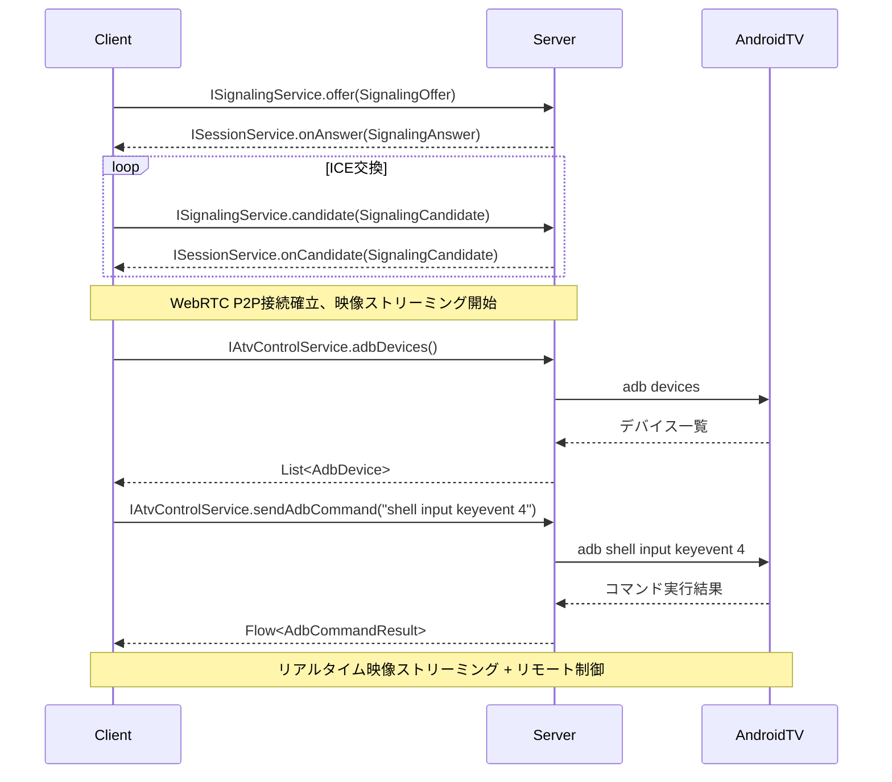

# **API仕様書：Signaling Library & ATV-Remote Demo**

### **1. 概要**

本文書は、WebRTC Signaling Library（signalinglib）とそのデモアプリケーション（ATV-Remote）における通信APIを定義します。
通信基盤として kotlinx-rpc ライブラリを採用し、全ての通信は単一のWebSocketコネクション上で行われます。

本プロジェクトは2つの主要なAPIレイヤーを提供します：

1. **汎用シグナリングAPI** (`signalinglib:shared`): 再利用可能なWebRTCシグナリング機能
2. **アプリケーション固有API** (`signalinglib:demo:shared`): ATV-Remote固有のデバイス制御機能

kotlinx-rpc の双方向通信モデルに基づき、以下のサービスインターフェースを定義します：

- **ISignalingService**: 汎用WebRTCシグナリング（クライアント → サーバー）
- **ISessionService**: 汎用セッション管理（サーバー → クライアント）
- **IAtvControlService**: ATV固有デバイス制御（クライアント → サーバー）

### **2. 共有データモデル**

#### **2.1 汎用シグナリングモデル** (`signalinglib:shared`)

WebRTCシグナリングで使用される汎用的なデータモデルです。他のWebRTCプロジェクトでも再利用可能です。

| クラス名             | プロパティ         | 型       | 説明                                         |
|:-----------------|:--------------|:--------|:-------------------------------------------|
| SessionID        | value         | String  | セッション識別子                                   |
| SignalingOffer   | sessionId     | SessionID | セッション識別子                                 |
|                  | sdp           | String  | SDP Offer本体の文字列                            |
| SignalingAnswer  | sessionId     | SessionID | セッション識別子                                 |
|                  | sdp           | String  | SDP Answer本体の文字列                           |
| SignalingCandidate | sessionId   | SessionID | セッション識別子                                 |
|                  | candidate     | IceCandidateData | ICE Candidate情報                      |
| IceCandidateData | candidate     | String  | ICE Candidate本体の文字列                       |
|                  | sdpMid        | String? | 関連付けられるメディア記述のID                          |
|                  | sdpMLineIndex | Int?    | 関連付けられるメディア記述のインデックス                      |

```kotlin
// signalinglib:shared/src/commonMain/kotlin/tokyo/isseikuzumaki/signalinglib/shared/SignalingModels.kt

@Serializable
@JvmInline
value class SessionID(val value: String)

@Serializable
data class SignalingOffer(
    val sessionId: SessionID,
    val sdp: String
)

@Serializable
data class SignalingAnswer(
    val sessionId: SessionID,
    val sdp: String
)

@Serializable
data class SignalingCandidate(
    val sessionId: SessionID,
    val candidate: IceCandidateData
)

@Serializable
data class IceCandidateData(
    val candidate: String,
    val sdpMid: String? = null,
    val sdpMLineIndex: Int? = null
)
```

#### **2.2 ATV-Remote固有モデル** (`signalinglib:demo:shared`)

ATV-Remote アプリケーション固有のデータモデルです。

| クラス名             | プロパティ         | 型       | 説明                                         |
|:-----------------|:--------------|:--------|:-------------------------------------------|
| AdbDevice        | id            | String  | デバイス識別子                                    |
|                  | name          | String  | デバイス表示名                                    |
|                  | status        | String  | デバイス状態（"device", "offline"等）              |
| AdbCommand       | deviceId      | String  | 対象デバイスID                                   |
|                  | command       | String  | 実行するADBコマンドの引数部分                           |
| AdbCommandResult | deviceId      | String  | 対象デバイスID                                   |
|                  | command       | String  | 実行されたコマンド                                  |
|                  | output        | String  | コマンドの実行結果（標準出力）                           |
|                  | error         | String? | エラー出力（標準エラー）                             |
|                  | isSuccess     | Boolean | コマンドが正常に終了したかどうかのフラグ                      |

```kotlin
// signalinglib:demo:shared/src/commonMain/kotlin/tokyo/isseikuzumaki/signalinglib/demo/shared/AtvModels.kt

@Serializable
data class AdbDevice(
    val id: String,
    val name: String,
    val status: String
)

@Serializable
data class AdbCommand(
    val deviceId: String,
    val command: String
)

@Serializable
data class AdbCommandResult(
    val deviceId: String,
    val command: String,
    val output: String,
    val error: String? = null,
    val isSuccess: Boolean
)
```

### **3. RPCサービス定義**

#### **3.1 汎用シグナリングサービス** (`signalinglib:shared`)

##### **3.1.1 ISignalingService (クライアント → サーバー)**

WebRTCシグナリングのためのサーバー側インターフェースです。他のWebRTCプロジェクトでも再利用可能です。

```kotlin
// signalinglib:shared/src/commonMain/kotlin/tokyo/isseikuzumaki/signalinglib/shared/ISignalingService.kt

interface ISignalingService : RPC {
    /**
     * WebRTC接続を開始するため、クライアントのSDP Offerをサーバーに送信します。
     * サーバーはこのOfferに対してAnswerを生成し、ISessionService.onAnswerで返送します。
     * @param offer SDP Offer情報とセッション識別子を含むデータクラス
     */
    suspend fun offer(offer: SignalingOffer)

    /**
     * WebRTC接続確立のため、クライアントのSDP Answerをサーバーに送信します。
     * @param answer SDP Answer情報とセッション識別子を含むデータクラス
     */
    suspend fun answer(answer: SignalingAnswer)

    /**
     * クライアント側で発見されたICE Candidateをサーバーに送信します。
     * @param candidate ICE Candidate情報とセッション識別子を含むデータクラス
     */
    suspend fun candidate(candidate: SignalingCandidate)
}
```

##### **3.1.2 ISessionService (サーバー → クライアント)**

サーバーからクライアントへのシグナリング通知のためのインターフェースです。

```kotlin
// signalinglib:shared/src/commonMain/kotlin/tokyo/isseikuzumaki/signalinglib/shared/ISessionService.kt

interface ISessionService : RPC {
    /**
     * サーバーが生成したSDP Offerをクライアントに送信します。
     * @param offer SDP Offer情報とセッション識別子を含むデータクラス
     */
    suspend fun onOffer(offer: SignalingOffer)

    /**
     * サーバーが生成したSDP Answerをクライアントに返送します。
     * @param answer SDP Answer情報とセッション識別子を含むデータクラス
     */
    suspend fun onAnswer(answer: SignalingAnswer)

    /**
     * サーバー側で発見されたICE Candidateをクライアントに送信します。
     * @param candidate ICE Candidate情報とセッション識別子を含むデータクラス
     */
    suspend fun onCandidate(candidate: SignalingCandidate)
}
```

#### **3.2 ATV-Remote固有サービス** (`signalinglib:demo:shared`)

##### **3.2.1 IAtvControlService (クライアント → サーバー)**

ATV-Remote固有のデバイス制御機能を提供するインターフェースです。

```kotlin
// signalinglib:demo:shared/src/commonMain/kotlin/tokyo/isseikuzumaki/signalinglib/demo/shared/IAtvControlService.kt

interface IAtvControlService : RPC {
    /**
     * 接続されているADBデバイスの一覧を取得します。
     * @return 検出されたデバイスのリスト
     */
    suspend fun adbDevices(): List<AdbDevice>

    /**
     * 指定されたADBコマンドの実行をサーバーに要求します。
     * 実行結果はFlowとしてストリーミングされます。
     * @param command 実行したいADBコマンド
     * @return コマンド実行結果のFlow
     */
    suspend fun sendAdbCommand(command: AdbCommand): Flow<AdbCommandResult>

    /**
     * 指定されたデバイスのスクリーンショットを取得します。
     * @param deviceId 対象デバイスID
     * @return スクリーンショットのバイト配列（PNG形式）
     */
    suspend fun getScreenshot(deviceId: String): ByteArray
}
```

### **4. 通信フローの例 (シーケンス)**

#### **4.1 汎用WebRTC シグナリングフロー**



#### **4.2 ATV-Remote デバイス制御フロー**



#### **4.3 統合フロー（WebRTC + ATV制御）**



### **5. 実装例とライブラリ使用方法**

#### **5.1 汎用ライブラリの使用方法**

他のWebRTCプロジェクトで汎用シグナリングライブラリを使用する例：

```kotlin
// build.gradle.kts
dependencies {
    implementation(project(":signalinglib:shared"))      // 共通インターフェース
    implementation(project(":signalinglib:server"))      // サーバー実装 (サーバーサイド)
    implementation(project(":signalinglib:client"))      // クライアント実装 (クライアントサイド)
}

// カスタムアプリケーションのRPCサービス実装
interface MyCustomService : RPC {
    suspend fun customMethod(): String
}

// 汎用シグナリング機能と組み合わせて使用
class MyWebRTCApp {
    private val signalingClient = SignalingClient("ws://localhost:8080")
    private val webrtcWrapper = WebRTCWrapper()

    suspend fun startConnection() {
        // 汎用シグナリングを使用してWebRTC接続を確立
        val sessionId = SessionID("my-session")
        val offer = webrtcWrapper.createOffer()
        signalingClient.offer(SignalingOffer(sessionId, offer.sdp))
    }
}
```

#### **5.2 デモアプリケーションでの実装例**

ATV-Remote固有機能と汎用シグナリングを組み合わせた実装：

```kotlin
// ATV-Remote専用ViewModel
class AtvRemoteViewModel : ViewModel() {
    private val signalingClient = SignalingClient("ws://localhost:8080")
    private val atvControlClient = AtvControlClient("ws://localhost:8080")

    suspend fun startAtvConnection() {
        // 1. WebRTCシグナリング開始
        val sessionId = SessionID("atv-session")
        signalingClient.offer(SignalingOffer(sessionId, createOffer().sdp))

        // 2. ATV固有機能の初期化
        val devices = atvControlClient.adbDevices()
        selectedDevice.value = devices.firstOrNull()
    }

    suspend fun sendRemoteCommand(keyEvent: Int) {
        selectedDevice.value?.let { device ->
            val command = AdbCommand(device.id, "shell input keyevent $keyEvent")
            atvControlClient.sendAdbCommand(command).collect { result ->
                // コマンド実行結果を処理
            }
        }
    }
}
```

### **6. パッケージ構造とモジュール依存関係**

```
tokyo.isseikuzumaki.signalinglib
├── shared/                     # 汎用WebRTCシグナリング (他プロジェクトで再利用可能)
│   ├── ISignalingService       # WebRTCシグナリングインターフェース
│   ├── ISessionService         # セッション管理インターフェース
│   └── SignalingModels         # 汎用データモデル
├── server/                     # 汎用シグナリングサーバー実装
│   ├── SignalingServiceImpl    # ISignalingService実装
│   └── SessionManager          # セッション管理実装
├── client/                     # 汎用シグナリングクライアント実装
│   ├── SignalingClient         # クライアントサイド実装
│   └── WebRTCWrapper           # WebRTC-KMPラッパー
└── demo/                      # ATV-Remote固有実装
    ├── shared/                # ATV固有共通コード
    │   ├── IAtvControlService # ATV制御インターフェース
    │   └── AtvModels          # ATV固有データモデル
    ├── server/                # ATV専用サーバー
    │   ├── AtvControlServiceImpl
    │   └── AdbManager
    └── composeApp/            # ATV専用UI
        ├── viewmodel/
        └── components/
```

### **7. 技術仕様**

- **RPC Framework**: kotlinx-rpc 0.9.1
- **WebRTC**: webrtc-kmp 0.125.11 (マルチプラットフォーム)
- **Serialization**: kotlinx-serialization (JSON)
- **Transport**: WebSocket over HTTP/HTTPS
- **Platform Support**: Android, iOS, Web (WebAssembly), JVM Server
